# RECOVERED: 121EnterprisesV2 — Org Structure + 121Solutions Overview
**Recovered by:** Jaria (Chief of Staff)
**Recovered:** 2026-09-18
**Sources:**
- Google Drive: https://drive.google.com/file/d/1XiUSeeHYBp7vOIxTGuxDNQ9PxfCEJ9TA/view
- Notion Sprint Plan: https://app.notion.com/p/3cba1d49911d81e9a96ef648844c92c1
- Notion 121Solutions Overview: https://app.notion.com/p/3caa1d49911d808d9e55edee0456b523

---

# 121EnterprisesV2 — Organizational Structure

**ISO Alignment:** ISO/IEC 12207 (Software Life Cycle), ISO 27001 (Information Security), ISO 9001 (Quality Management), ISO/IEC 27034 (Application Security), ISO 31000 (Risk Management)

---

## Org Chart (Mermaid)

```mermaid
graph TD
    CEO["CEO"]
    CEO --> CIO["CIO"]
    CEO --> CTO["CTO"]
    CEO --> CFO["CFO"]
    CEO --> COO["COO"]
    CIO --> ITGOV["IT Governance Mgr"]
    CIO --> CISO["CISO"]
    CIO --> EA["Enterprise Architect"]
    CISO --> SECENG["Security Engineer"]
    CISO --> SECANA["Security Analyst"]
    ITGOV --> ITAUD["IT Auditor"]
    CTO --> VPENG["VP Engineering"]
    CTO --> VPDATA["VP Data & Analytics"]
    CTO --> DEVOPSMGR["DevOps Manager"]
    VPENG --> TL1["Team Lead Backend"]
    VPENG --> TL2["Team Lead Frontend"]
    VPENG --> TL3["Team Lead Mobile"]
    VPENG --> QAM["QA Manager"]
    TL1 --> SRBE["Sr Backend Engineer"]
    TL1 --> BE["Backend Engineer"]
    TL2 --> SRFE["Sr Frontend Engineer"]
    TL2 --> FE["Frontend Engineer"]
    TL3 --> MOBILE["Mobile Engineer"]
    QAM --> QAENG["QA Engineer"]
    QAM --> SDET["SDET"]
    DEVOPSMGR --> SRE["SRE"]
    DEVOPSMGR --> DEVOPS["DevOps Engineer"]
    DEVOPSMGR --> CLOUD["Cloud Engineer"]
    VPDATA --> DSL["Data Science Lead"]
    VPDATA --> DEL["Data Engineering Lead"]
    DSL --> DS["Data Scientist"]
    DSL --> MLE["ML Engineer"]
    DEL --> DE["Data Engineer"]
    DEL --> BA["BI Analyst"]
    COO --> CSMGR["Customer Support Mgr"]
    COO --> SSMGR["Shared Services Mgr"]
    CSMGR --> CSSUP["Support Team Lead"]
    CSSUP --> CSTIER1["Tier 1 Support Agent"]
    CSSUP --> CSTIER2["Tier 2 Support Engineer"]
    CSMGR --> CXANA["CX Analyst"]
    SSMGR --> HRMGR["HR Manager"]
    SSMGR --> FACMGR["Facilities Manager"]
    SSMGR --> PROCMGR["Procurement Officer"]
    CFO --> CTRL["Financial Controller"]
    CFO --> FPMGR["FP&A Manager"]
    CTRL --> ACCT["Accountant"]
    FPMGR --> FPANAL["Financial Analyst"]
    FPMGR --> BUDANAL["Budget Analyst"]
```

---

## Detailed Roles Table — 48 Roles Across 8 Departments

### C-Suite / Executive Leadership (5 roles)

| Dept | Role | Name | Avatar | Skills Needed | Reports To | Responsible For |
|------|------|------|--------|---------------|------------|-----------------|
| Executive | CEO | TBD | 🏢 | Strategic leadership, P&L, board relations, M&A, industry vision | Board of Directors | Company strategy, culture, investor relations |
| Executive | CIO | TBD | 💼 | IT strategy, COBIT/ITIL, ISO 27001, risk mgmt, vendor management | CEO | IT governance, infosec policy, enterprise architecture, compliance |
| Executive | CTO | TBD | ⚙️ | Software architecture, technology roadmaps, ISO 12207, Agile/SAFe | CEO | Technology vision, engineering, DevOps, data platform, build vs. buy |
| Executive | CFO | TBD | 💰 | Financial planning, GAAP/IFRS, budgeting, audit | CEO | Budget office, financial reporting, capital allocation, audit readiness |
| Executive | COO | TBD | 🔧 | Operations, process optimization, ISO 9001, vendor/contract mgmt | CEO | Customer support, shared services, operational efficiency |

### IT Governance & Security (6 roles — reports to CIO)

| Dept | Role | Name | Avatar | Skills Needed | Reports To | Responsible For |
|------|------|------|--------|---------------|------------|-----------------|
| IT Governance | IT Governance & Compliance Mgr | TBD | 🛡️ | ISO 27001, GDPR/SOC2/HIPAA, risk registers, policy drafting | CIO | ISO compliance, audit schedules, policy lifecycle, regulatory tracking |
| IT Governance | IT Auditor | TBD | 📋 | Audit methodologies, control testing, COSO framework | IT Gov Mgr | Internal audits, control assessments, non-conformity tracking |
| Information Security | CISO | TBD | 🔐 | Threat modeling, incident response, zero-trust architecture | CIO | Security strategy, incident response, vulnerability management |
| Information Security | Security Engineer | TBD | 🔒 | Pen testing, SAST/DAST, IAM, network security, SIEM | CISO | Security tooling, vulnerability remediation, infrastructure hardening |
| Information Security | Security Analyst | TBD | 🔍 | SOC operations, log analysis, threat intel, incident triage | CISO | Monitoring, alert triage, incident investigation, metrics |
| Enterprise Architecture | Enterprise Architect | TBD | 🗺️ | TOGAF/Zachman, solution design, integration patterns, cloud strategy | CIO | Architecture governance, technology standards, technical debt roadmap |

### Engineering (12 roles — reports to CTO)

| Dept | Role | Name | Avatar | Skills Needed | Reports To | Responsible For |
|------|------|------|--------|---------------|------------|-----------------|
| Engineering | VP Engineering | TBD | 🔧 | Eng management, Agile at scale, ISO 12207, capacity planning, hiring | CTO | Delivery, sprint cadence, hiring, code quality standards |
| Engineering | Team Lead — Backend | TBD | 👨‍💻 | System design, API architecture, microservices, mentoring | VP Engineering | Backend squad, architecture decisions, code review |
| Engineering | Sr Backend Engineer | TBD | 💻 | Java/Python/Go/Node.js, distributed systems, TDD | Team Lead Backend | Feature dev, design docs, mentoring juniors |
| Engineering | Backend Engineer | TBD | 💻 | Core language, ORM, unit testing, Git, CI/CD | Team Lead Backend | Implementation, bug fixes, test coverage |
| Engineering | Team Lead — Frontend | TBD | 👩‍💻 | React/Angular/Vue, design systems, WCAG | VP Engineering | Frontend squad, UI/UX standards, component library |
| Engineering | Sr Frontend Engineer | TBD | 🖥️ | TypeScript, state mgmt, Webpack/Vite, Jest/Cypress | Team Lead Frontend | UI delivery, performance, accessibility |
| Engineering | Frontend Engineer | TBD | 🖥️ | HTML/CSS/JS, component frameworks, responsive | Team Lead Frontend | UI implementation, bug fixes, unit tests |
| Engineering | Team Lead — Mobile | TBD | 📱 | Swift, Kotlin, React Native/Flutter, mobile CI/CD | VP Engineering | Mobile squad, platform parity, release management |
| Engineering | Mobile Engineer | TBD | 📱 | Swift or Kotlin, offline-first, push notifications | Team Lead Mobile | Feature dev, platform implementation |
| Engineering | QA Manager | TBD | ✅ | Test strategy, automation, ISO 12207 V&V, defect mgmt | VP Engineering | QA process, test automation roadmap, release quality gates |
| Engineering | QA Engineer | TBD | ✅ | Manual/exploratory testing, regression, Jira | QA Manager | Test execution, defect logging, regression suites |
| Engineering | SDET | TBD | ✅ | Selenium/Playwright, API testing, k6/JMeter, CI integration | QA Manager | Test automation frameworks, CI pipeline test stages |

### DevOps (4 roles — reports to CTO)

| Dept | Role | Name | Avatar | Skills Needed | Reports To | Responsible For |
|------|------|------|--------|---------------|------------|-----------------|
| DevOps | DevOps Manager | TBD | 🚀 | CI/CD, IaC (Terraform), K8s, SLA/SLO definition | CTO | Pipelines, infra automation, incident mgmt process |
| DevOps | SRE | TBD | 🔧 | Kubernetes, Prometheus/Grafana/Datadog, chaos engineering | DevOps Manager | Production reliability, monitoring, capacity planning |
| DevOps | DevOps Engineer | TBD | 🛠️ | Docker, K8s, GitHub Actions/Jenkins, IaC, Bash/Python | DevOps Manager | Pipeline maintenance, deployment automation, env provisioning |
| DevOps | Cloud Engineer | TBD | ☁️ | AWS/Azure/GCP, networking, cost optimization, IaC | DevOps Manager | Cloud infra, cost governance, DR, network architecture |

### Data Analytics & Science (7 roles — reports to CTO)

| Dept | Role | Name | Avatar | Skills Needed | Reports To | Responsible For |
|------|------|------|--------|---------------|------------|-----------------|
| Data & Analytics | VP Data & Analytics | TBD | 📊 | Data strategy, ML/AI roadmap, data governance, team building | CTO | Data platform vision, analytics strategy, cross-functional data |
| Data Science | Data Science Lead | TBD | 🧪 | Statistical modeling, PyTorch/TensorFlow/sklearn, experiment design | VP Data | ML models, A/B testing, research-to-production pipeline |
| Data Science | Data Scientist | TBD | 🧪 | Python/R, stats, feature engineering, Jupyter | Data Science Lead | Model building, hypothesis testing, exploratory analysis |
| Data Science | ML Engineer | TBD | 🤖 | MLOps, model serving, feature stores, distributed training | Data Science Lead | Model deployment, inference pipelines, retraining automation |
| Data Engineering | Data Engineering Lead | TBD | 🔩 | Airflow/dbt, warehouse arch, Kafka/Flink, data quality | VP Data | Data platform, ETL/ELT, schema governance |
| Data Engineering | Data Engineer | TBD | 🔩 | SQL, Python, Snowflake/BigQuery/Redshift, Airflow | Data Engineering Lead | Pipeline dev, transformations, source integrations |
| Data Engineering | BI Analyst | TBD | 📈 | Tableau/Power BI/Looker, SQL, data storytelling | Data Engineering Lead | Dashboards, KPI tracking, self-service analytics |

### Customer Support (5 roles — reports to COO)

| Dept | Role | Name | Avatar | Skills Needed | Reports To | Responsible For |
|------|------|------|--------|---------------|------------|-----------------|
| Customer Support | Customer Support Manager | TBD | 🧑 | SLA mgmt, CSAT/NPS, team leadership, escalation mgmt | COO | Support strategy, SLA compliance, knowledge base |
| Customer Support | Support Team Lead | TBD | 🎯 | Ticket triage, coaching, product knowledge | CS Manager | Daily ops, scheduling, quality reviews |
| Customer Support | Tier 1 Support Agent | TBD | 💬 | Communication, Zendesk/Freshdesk, empathy | Support Team Lead | First-contact resolution, ticket logging |
| Customer Support | Tier 2 Support Engineer | TBD | 🔧 | Technical troubleshooting, log analysis, SQL, API debugging | Support Team Lead | Complex issues, bug reproduction, engineering escalations |
| Customer Support | CX Analyst | TBD | 📊 | Survey design, CSAT/NPS analysis, reporting | CS Manager | Satisfaction metrics, churn analysis, trend reports |

### Shared Office Services (4 roles — reports to COO)

| Dept | Role | Name | Avatar | Skills Needed | Reports To | Responsible For |
|------|------|------|--------|---------------|------------|-----------------|
| Shared Services | Shared Services Manager | TBD | 🏬 | Ops mgmt, vendor mgmt, HR oversight, facilities planning | COO | HR, facilities, procurement, vendor relationships |
| Shared Services — HR | HR Manager | TBD | 👥 | Talent acquisition, labor law, benefits, DEI | Shared Services Manager | Hiring, onboarding, employee relations, compliance training |
| Shared Services — Facilities | Facilities Manager | TBD | 🏢 | Workplace safety, space planning, asset management | Shared Services Manager | Office ops, workplace safety, equipment lifecycle |
| Shared Services — Procurement | Procurement Officer | TBD | 📦 | Vendor evaluation, contract negotiation, SaaS license mgmt | Shared Services Manager | Procurement, vendor onboarding, license tracking, cost optimization |

### Budget Office / Finance (5 roles — reports to CFO)

| Dept | Role | Name | Avatar | Skills Needed | Reports To | Responsible For |
|------|------|------|--------|---------------|------------|-----------------|
| Finance | Financial Controller | TBD | 📒 | GAAP/IFRS, GL mgmt, internal controls, audit preparation | CFO | Financial reporting, close cycles, audit coordination |
| Finance | Accountant | TBD | 🧮 | AP/AR, reconciliation, payroll, tax filing, ERP | Financial Controller | Transaction processing, payroll, tax compliance |
| Finance — FP&A | FP&A Manager | TBD | 📈 | Financial modeling, forecasting, scenario planning | CFO | Budget process, forecasting cycles, board financial reporting |
| Finance — FP&A | Financial Analyst | TBD | 📊 | Excel modeling, data analysis, ERP reporting | FP&A Manager | Revenue/cost models, variance reports, ad-hoc analysis |
| Finance — FP&A | Budget Analyst | TBD | 💵 | Budget tracking, cost centers, spend analysis | FP&A Manager | Dept budget tracking, spend monitoring, budget-vs-actual |

---

## Headcount Summary

| Department | Headcount |
|---|---|
| Executive (C-Suite) | 5 |
| IT Governance & Security | 6 |
| Engineering | 12 |
| DevOps | 4 |
| Data Analytics & Science | 7 |
| Customer Support | 5 |
| Shared Office Services | 4 |
| Budget Office / Finance | 5 |
| **Total** | **48** |

---

## ISO Compliance Mapping

| ISO Standard | Function | Key Roles |
|---|---|---|
| **ISO/IEC 12207** — Software Life Cycle | Engineering, QA, DevOps | VP Engineering, QA Manager, DevOps Manager, Team Leads |
| **ISO 27001** — Information Security | IT Governance, Security | CIO, CISO, IT Governance Manager, Security Engineer/Analyst |
| **ISO 9001** — Quality Management | QA, Customer Support, All Depts | QA Manager, COO, Customer Support Manager, IT Auditor |
| **ISO/IEC 27034** — Application Security | Security, Engineering | CISO, Security Engineer, SDET, DevOps Manager |
| **ISO 31000** — Risk Management | Governance, Executive | CIO, IT Governance Manager, CFO, Financial Controller |

---

# 121Solutions — Product & Services Overview

**Mission:** Helps organizations turn data into decisions with practical, production-ready engineering and analytics.

## Services

### Data & Web Scraping
- Custom web data extraction (static + dynamic sites)
- API integrations and data aggregation
- Scheduled collection pipelines and monitoring
- Data normalization, deduplication, and enrichment

### Data Engineering
- ETL/ELT pipelines and automation
- Data warehousing and lakehouse design
- Data quality checks, lineage, and observability
- Secure data handling and access controls

### Analytics & Reporting
- KPI dashboards and automated reporting
- Ad-hoc analysis and decision support
- Metric definitions and documentation

### Automation & Integrations
- Workflow automation across business tools
- Notifications, approvals, and audit trails
- Custom internal tools

## Platforms & Products (9 products)

| Product | Description |
|---------|-------------|
| **121 CRM** | AI-assisted CRM — pipeline management, analytics, workflow automation |
| **121 Analytics as a Service** | Managed analytics, predictive modelling, BI dashboards — no in-house data science required |
| **121 Skills** | Learning Management Portal — courses, exams, certificates, fees, financials |
| **121 Pay** | Multi-currency fintech payments and e-wallet platform |
| **121 Club** | Business loyalty & rewards network across participating businesses |
| **121 Call Center** | Outsourced inbound/outbound contact centre and marketing services |
| **121 BPO** | Back-office outsourcing — accounting, bookkeeping, medical coding, billing, tax, payroll |
| **121 Ride / Orbit Ride** | Tracked logistics & delivery — valuables, food, grocery, parcels, passenger transport |
| **LaunchReady (Biz-in-a-Box)** | End-to-end business launch service (USA/UK) — incorporation through income-generating ops |

## Why 121Solutions
- **Integrated ecosystem** — platforms designed to work together seamlessly
- **SME-focused** — enterprise capabilities at a fraction of traditional cost
- **Global deployment** — US, UK, and international markets
- **Managed service model** — technology without the infrastructure headache
- **Backed by Smarter Mergers** advisory expertise for strategic alignment

## How We Work
1. **Discovery** — confirm goals, data sources, constraints, success metrics
2. **Build** — deliver an initial working version quickly
3. **Validate** — QA, edge cases, reliability, documentation
4. **Operate** — hosting/hand-off, monitoring, continuous improvement

---

# Team Guidelines (121 Solutions)

## Shift Schedule

| Shift | PK Time |
|-------|---------|
| Morning | 6 AM – 3 PM |
| Afternoon | 2 PM – 11 PM |
| Night | 6 PM – 3 AM |
| Flex | 6 PM – 9 PM + 5 hrs |
| Freelance | Per agreed terms, scope, deliverables, price |

## Operating Principles
- Mon–Sat, 8 hours/day plus own-time breaks
- 24-hour advance approval for absence
- All tasks and time must be logged for reporting
- Mandatory daily breaks: 2 × 15 min + 1 × 30 min
- One team — succeed together, solve problems together
- Listen and observe 70%, speak 30%
- Protect positive energy from negative influences

---

# Sprint Backlog — Action Items (from 121Enterprises Next Sprint Plan)

- [ ] Assign names to all 48 TBD roles in 121EnterpriseV2 org structure
- [ ] Finalize CIO vs CTO scope boundaries and publish RACI
- [ ] Set up ISO 27001 compliance checklist and assign to IT Governance
- [ ] Onboard DevOps Manager — establish CI/CD pipeline standards
- [ ] Stand up 121 CRM development environment
- [ ] Launch 121 Analytics as a Service pilot with internal data
- [ ] Configure 121Solutions shift schedules in project management tool
- [ ] Draft job descriptions for first-hire priorities per department
- [ ] Establish sprint cadence and ceremonies (standup, retro, planning)
- [ ] Create department-level OKRs aligned to company strategy
- [ ] Set up shared services vendor evaluation framework
- [ ] Budget office: build initial financial model for 121EnterpriseV2 ops

---

*Recovered from chat transcript. Original sources live in Google Drive and Notion (links above).*
*Sprint planned by Rashad Khan, CEO — 121Enterprises / 121Solutions / Smarter Mergers*
